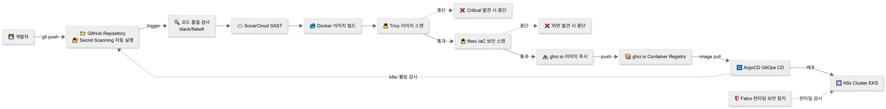
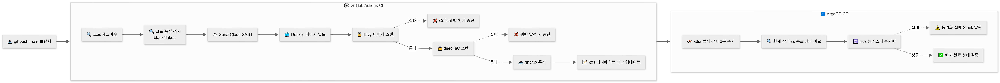
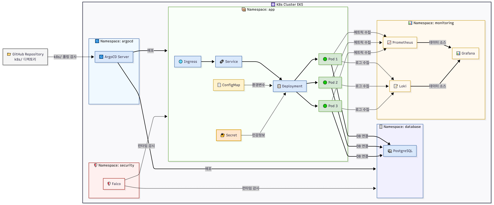

# Secure GitOps Platform

> 보안이 코드로 내재화된 GitOps K8s 플랫폼

---

## 프로젝트 소개

이 프로젝트는 코드 푸시부터 K8s 배포까지 전 과정에 보안 검증이 자동으로 수행되는 플랫폼입니다.

보안을 별도 단계로 두지 않고 CI/CD 파이프라인과 인프라 코드에 직접 내재화하는 것을 핵심 목표로 합니다.

- **CI 단계**: SonarCloud(SAST), Trivy(SCA), tfsec(IaC 스캔) 자동 실행
- **CD 단계**: ArgoCD GitOps로 K8s 선언 상태와 실제 상태 자동 동기화. 무단 변경 시 자동 복구
- **런타임 단계**: Falco로 K8s 클러스터 내 이상 행동 실시간 탐지
- **관측성**: Prometheus + Grafana + Loki로 메트릭, 로그, 보안 이벤트 통합 모니터링

---

## 보안 설계 의도

| 단계 | 도구 | 탐지 대상 |
|---|---|---|
| 코드 단계 | SonarCloud | SQL Injection, 하드코딩 시크릿, 버그 |
| 빌드 단계 | Trivy | 이미지 내 취약한 라이브러리 |
| IaC 단계 | tfsec | Terraform 잘못된 보안 설정 |
| 시크릿 단계 | GitHub Secret Scanning | Git 커밋 내 시크릿 노출 |
| 배포 단계 | ArgoCD | 무단 클러스터 변경 감지 및 복구 |
| 런타임 단계 | Falco | 컨테이너 이상 행동 실시간 탐지 |

---

## 아키텍처

### 1. 전체 흐름


### 2. CI/CD 파이프라인 상세



### 3. K8s 클러스터 내부 구조


---

## 기술 스택

| 영역 | 기술 | 용도 |
|---|---|---|
| 앱 | Python, FastAPI | 애플리케이션 |
| DB | PostgreSQL | 데이터 저장 |
| 컨테이너 | Docker | 이미지 빌드 |
| 오케스트레이션 | Kubernetes, Helm | 컨테이너 관리 |
| 인프라 | Terraform, AWS EKS | 클라우드 인프라 |
| CI | GitHub Actions | 빌드, 스캔, 푸시 자동화 |
| CD | ArgoCD | GitOps 배포 자동화 |
| SAST | SonarCloud | 소스코드 보안 취약점 분석 |
| SCA | Trivy | 이미지 라이브러리 취약점 스캔 |
| IaC 스캔 | tfsec | Terraform 보안 설정 검증 |
| 시크릿 스캔 | GitHub Secret Scanning | Git 커밋 시크릿 탐지 |
| 런타임 보안 | Falco | 컨테이너 이상 행동 탐지 |
| 관측성 | Prometheus, Grafana, Loki | 메트릭, 대시보드, 로그 |
| 이미지 레지스트리 | ghcr.io | 컨테이너 이미지 저장 |
| 시크릿 관리 | AWS Secrets Manager | 민감 정보 관리 |
| IaC 패키징 | Kustomize | 환경별 K8s 설정 관리 |
| 코드 품질 | black, flake8 | Python 코드 스타일 |

---

## 디렉토리 구조

```
secure-gitops-platform/
├── app/
│   ├── main.py
│   ├── routers/
│   │   ├── health.py
│   │   └── items.py
│   ├── models/
│   │   └── schemas.py
│   ├── requirements.txt
│   └── Dockerfile
├── infra/
│   ├── main.tf
│   ├── variables.tf
│   └── outputs.tf
├── k8s/
│   ├── base/
│   │   ├── deployment.yaml
│   │   ├── service.yaml
│   │   ├── ingress.yaml
│   │   └── networkpolicy.yaml
│   └── overlays/
│       ├── dev/
│       └── prod/
├── .github/
│   └── workflows/
│       └── ci.yaml
├── docs/
│   ├── images/
│   │   ├── architecture-overview.png
│   │   ├── cicd-pipeline.png
│   │   └── k8s-cluster.png
│   └── adr/
├── ARCHITECTURE.md
├── SECURITY.md
└── README.md
```

---

## Namespace 구성

| Namespace | 구성 요소 | 설명 |
|---|---|---|
| `app` | FastAPI | 애플리케이션 |
| `database` | PostgreSQL | DB 분리로 NetworkPolicy 적용 |
| `monitoring` | Prometheus, Grafana, Loki | 메트릭, 로그 통합 |
| `security` | Falco | 런타임 보안 탐지 |
| `argocd` | ArgoCD Server | GitOps CD |

> database namespace를 분리한 이유: app → database 단방향 통신만 허용하는 NetworkPolicy 적용으로 최소 권한 원칙을 네트워크 레벨에서 구현

---

## 보안 설계 원칙

1. **파이프라인 보안 내재화**: Critical 취약점 발견 시 배포 자동 차단
2. **IaC 보안 스캔**: Terraform 코드 보안 설정 자동 검증
3. **런타임 보안**: Falco로 K8s 클러스터 이상 행동 실시간 탐지
4. **시크릿 코드 분리**: AWS Secrets Manager로 민감 정보 코드베이스 외부 관리
5. **최소 권한 원칙**: IRSA로 Pod별 IAM 권한 최소화, NetworkPolicy로 namespace 간 통신 제어
6. **무단 변경 방지**: ArgoCD GitOps로 클러스터 상태 자동 복구

---

## 로컬 실행 방법

### 사전 요구사항

- Docker Desktop
- kind
- kubectl

### 클러스터 실행

```bash
# 클러스터 생성
kind create cluster --name devsecops-lab

# 앱 빌드
docker build -t secure-gitops-app:latest ./app

# 실행 확인
docker run -p 8080:8080 secure-gitops-app:latest
```

---

## 구현 진행 상황

- [x] 프로젝트 구조 설계
- [x] FastAPI 앱 구현
- [x] Docker 빌드 환경 구성
- [ ] CRUD 엔드포인트 + PostgreSQL 연동
- [ ] GitHub Actions CI 파이프라인
- [ ] SonarCloud 통합
- [ ] K8s 매니페스트 작성
- [ ] ArgoCD GitOps 구성
- [ ] Prometheus + Grafana + Loki 관측성 스택
- [ ] Trivy + tfsec 보안 스캔 통합
- [ ] Falco 런타임 보안
- [ ] AWS EKS Terraform 배포


## Author

김동규 | [GitHub](https://github.com/KDongGyu1) | [Velog](https://velog.io/@kimdk1125)