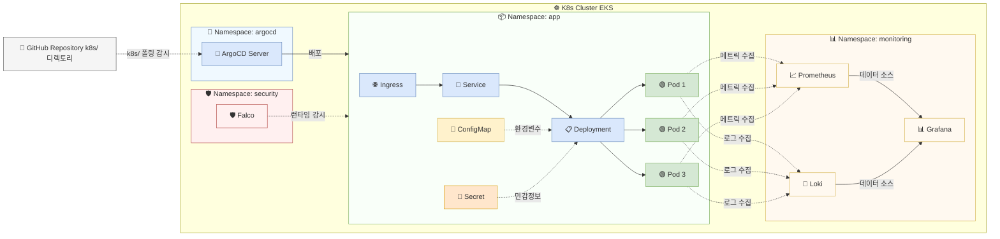

# Secure GitOps Platform

> 보안이 코드로 내재화된 GitOps K8s 플랫폼

---

## 프로젝트 소개

이 프로젝트는 코드 푸시부터 K8s 배포까지 전 과정에 보안 검증이 자동으로 수행되는 플랫폼입니다.

보안을 별도 단계로 두지 않고 CI/CD 파이프라인과 인프라 코드에 직접 내재화하는 것을 핵심 목표로 합니다.

- **CI 단계**: 코드 푸시 시 이미지 취약점 스캔(Trivy), IaC 보안 스캔(tfsec) 자동 실행
- **CD 단계**: ArgoCD GitOps로 K8s 선언 상태와 실제 상태 자동 동기화
- **런타임 단계**: Falco로 K8s 클러스터 내 이상 행동 실시간 탐지
- **관측성**: Prometheus + Grafana + Loki로 메트릭, 로그 통합 모니터링

---

## 아키텍처

### 1. 전체 흐름

```mermaid
flowchart LR
    Dev["👨‍💻 개발자"]
    GH["📁 GitHub Repository"]
    S1["🔍 코드 품질 검사 black/flake8"]
    S2["🐳 Docker 이미지 빌드"]
    S3["🔒 Trivy 이미지 스캔"]
    STOP1["❌ Critical 발견 시 중단"]
    S4["🔒 tfsec IaC 보안 스캔"]
    STOP2["❌ 위반 발견 시 중단"]
    S5["📤 ghcr.io 이미지 푸시"]
    REG["📦 ghcr.io Container Registry"]
    ARGO["🔄 ArgoCD GitOps CD"]
    K8S["☸️ K8s Cluster EKS"]
    FALCO["🛡️ Falco 런타임 보안 탐지"]

    Dev -->|"git push"| GH
    GH -->|"trigger"| S1
    S1 --> S2
    S2 --> S3
    S3 -.->|"중단"| STOP1
    S3 -->|"통과"| S4
    S4 -.->|"중단"| STOP2
    S4 -->|"통과"| S5
    S5 -->|"push"| REG
    REG -->|"image pull"| ARGO
    ARGO -->|"배포"| K8S
    ARGO -.->|"k8s/ 폴링 감시"| GH
    FALCO -.->|"런타임 감시"| K8S

    style Dev fill:#dae8fc,stroke:#6c8ebf
    style GH fill:#f5f5f5,stroke:#666666
    style S1 fill:#fff2cc,stroke:#d6b656
    style S2 fill:#fff2cc,stroke:#d6b656
    style S3 fill:#ffe6cc,stroke:#d79b00
    style S4 fill:#ffe6cc,stroke:#d79b00
    style S5 fill:#d5e8d4,stroke:#82b366
    style STOP1 fill:#f8cecc,stroke:#b85450
    style STOP2 fill:#f8cecc,stroke:#b85450
    style REG fill:#dae8fc,stroke:#6c8ebf
    style ARGO fill:#d5e8d4,stroke:#82b366
    style K8S fill:#dae8fc,stroke:#6c8ebf
    style FALCO fill:#ffe6cc,stroke:#d79b00
```



### 2. CI/CD 파이프라인 상세

```mermaid
flowchart LR
    PUSH["📤 git push main 브랜치"]

    subgraph CI["⚙️ GitHub Actions CI"]
        direction LR
        C1["🔍 코드 체크아웃"]
        C2["🔍 코드 품질 검사 black/flake8"]
        C3["🐳 Docker 이미지 빌드"]
        C4["🔒 Trivy 이미지 스캔"]
        CFAIL1["❌ Critical 발견 시 중단"]
        C5["🔒 tfsec IaC 스캔"]
        CFAIL2["❌ 위반 발견 시 중단"]
        C6["📤 ghcr.io 푸시"]
        C7["📝 k8s 매니페스트 태그 업데이트"]

        C1 --> C2 --> C3 --> C4
        C4 -.->|"실패"| CFAIL1
        C4 -->|"통과"| C5
        C5 -.->|"실패"| CFAIL2
        C5 -->|"통과"| C6
        C6 --> C7
    end

    subgraph CD["🔄 ArgoCD CD"]
        direction LR
        A1["👁️ k8s/ 폴링 감시 3분 주기"]
        A2["🔍 현재 상태 vs 목표 상태 비교"]
        A3["☸️ K8s 클러스터 동기화"]
        A4["✅ 배포 완료 상태 검증"]
        AFAIL["⚠️ 동기화 실패 Slack 알림"]

        A1 --> A2 --> A3
        A3 -.->|"실패"| AFAIL
        A3 -->|"성공"| A4
    end

    PUSH --> CI
    C7 --> CD

    style PUSH fill:#f5f5f5,stroke:#666666
    style C1 fill:#fff2cc,stroke:#d6b656
    style C2 fill:#fff2cc,stroke:#d6b656
    style C3 fill:#fff2cc,stroke:#d6b656
    style C4 fill:#ffe6cc,stroke:#d79b00
    style C5 fill:#ffe6cc,stroke:#d79b00
    style C6 fill:#d5e8d4,stroke:#82b366
    style C7 fill:#d5e8d4,stroke:#82b366
    style CFAIL1 fill:#f8cecc,stroke:#b85450
    style CFAIL2 fill:#f8cecc,stroke:#b85450
    style A1 fill:#dae8fc,stroke:#6c8ebf
    style A2 fill:#dae8fc,stroke:#6c8ebf
    style A3 fill:#dae8fc,stroke:#6c8ebf
    style A4 fill:#d5e8d4,stroke:#82b366
    style AFAIL fill:#f8cecc,stroke:#b85450
```



### 3. K8s 클러스터 내부 구조



---

## 기술 스택

| 영역 | 기술 | 용도 |
|---|---|---|
| 앱 | Python, FastAPI | 애플리케이션 |
| 컨테이너 | Docker | 이미지 빌드 |
| 오케스트레이션 | Kubernetes, Helm | 컨테이너 관리 |
| 인프라 | Terraform, AWS EKS | 클라우드 인프라 |
| CI | GitHub Actions | 빌드, 스캔, 푸시 자동화 |
| CD | ArgoCD | GitOps 배포 자동화 |
| 관측성 | Prometheus, Grafana, Loki | 메트릭, 대시보드, 로그 |
| 보안 스캔 | Trivy, tfsec, Falco | 이미지/IaC/런타임 보안 |
| 이미지 레지스트리 | ghcr.io | 컨테이너 이미지 저장 |
| 시크릿 관리 | AWS Secrets Manager | 민감 정보 관리 |
| IaC 패키징 | Kustomize | 환경별 K8s 설정 관리 |
| 코드 품질 | black, flake8 | Python 코드 스타일 |

---

## 디렉토리 구조

```
secure-gitops-platform/
├── app/
│   ├── main.py
│   ├── routers/
│   │   └── health.py
│   ├── requirements.txt
│   └── Dockerfile
├── infra/
│   ├── main.tf
│   ├── variables.tf
│   └── outputs.tf
├── k8s/
│   ├── base/
│   │   ├── deployment.yaml
│   │   ├── service.yaml
│   │   └── ingress.yaml
│   └── overlays/
│       ├── dev/
│       └── prod/
├── .github/
│   └── workflows/
│       └── ci.yaml
├── docs/
│   └── adr/
├── ARCHITECTURE.md
├── SECURITY.md
└── README.md
```

---

## 보안 설계 원칙

1. **파이프라인 보안 내재화**: Critical 취약점 발견 시 배포 자동 차단
2. **IaC 보안 스캔**: Terraform 코드 보안 설정 자동 검증
3. **런타임 보안**: Falco로 K8s 클러스터 이상 행동 실시간 탐지
4. **시크릿 코드 분리**: AWS Secrets Manager로 민감 정보 코드베이스 외부 관리
5. **최소 권한 원칙**: IRSA로 Pod별 IAM 권한 최소화

---

## 로컬 실행 방법

### 사전 요구사항

- Docker Desktop
- kind
- kubectl

### 클러스터 실행

```bash
# 클러스터 생성
kind create cluster --name devsecops-lab

# 앱 빌드
docker build -t secure-gitops-app:latest ./app

# 실행 확인
docker run -p 8080:8080 secure-gitops-app:latest
```

---

## 구현 진행 상황

- [x] 프로젝트 구조 설계
- [x] FastAPI 앱 구현
- [x] Docker 빌드 환경 구성
- [ ] GitHub Actions CI 파이프라인
- [ ] K8s 매니페스트 작성
- [ ] ArgoCD GitOps 구성
- [ ] Prometheus + Grafana + Loki 관측성 스택
- [ ] Trivy + tfsec 보안 스캔 통합
- [ ] Falco 런타임 보안
- [ ] AWS EKS Terraform 배포

---

## Author

김동규 | [GitHub](https://github.com/KDongGyu1) | [Velog](https://velog.io/@kimdk1125)